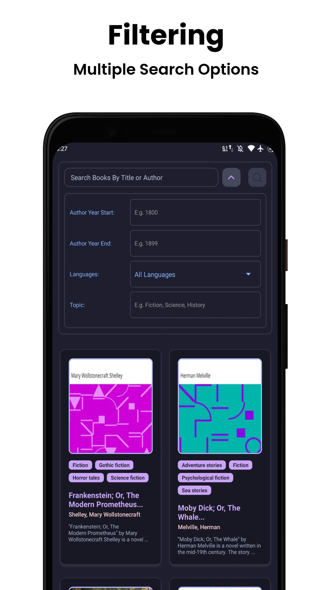
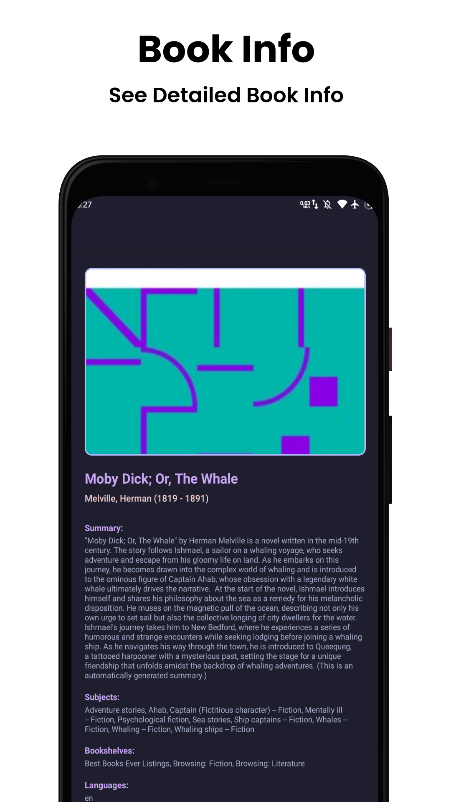
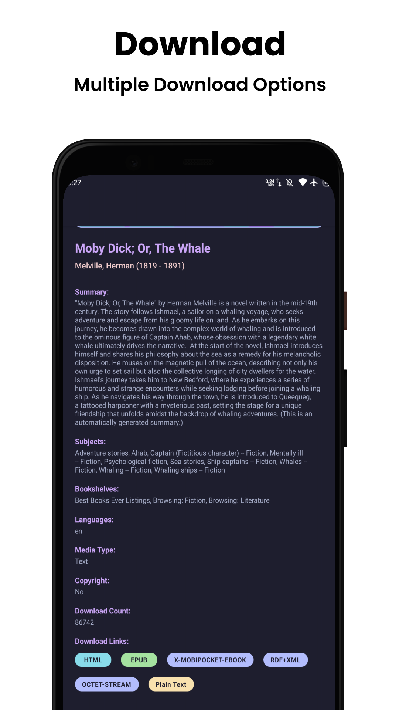
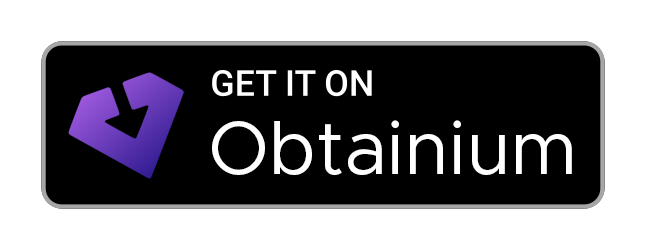

<!-- Project Logo -->

  

<h1 align="center">GlutenBurg</h1>

  
  
  

<b>Pre-alpha:</b> This app is currently in pre-alpha state and under active development.

GlutenBurg is a free and open source (FOSS) React Native app for browsing, searching, and downloading free eBooks from [Project Gutenberg](https://www.gutenberg.org/) via the [Gutendex API](https://gutendex.com/).

  
  
  
  

## Installation

## Features

- Search for books by title, author, or keyword
- Browse book details, including cover, author, and summary
- Download books in multiple formats
- View book subjects and metadata
- Fast Refresh and offline caching for a smooth experience

### Using the App
- Use the search bar to find books from Project Gutenberg.
- Tap a book to view details and available download formats.
- Tap a format to download or open the book in your browser or compatible app.

## License

This project is licensed under the GNU General Public License v3.0 (GPLv3). See the [LICENSE](LICENSE) file for details.

See the [full dependency license table](LICENSES_TABLE.md) for details on all core and development dependencies used in this project.

